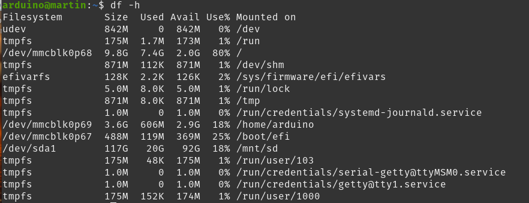

# Running Small Ollama Models on Arduino Uno Q

## Setup

### General Terms
Large Language Models are huge and even the smallest, we are using here takes 600MB and the Docker image of Ollama takes 6GB, to large for the Arduino internal space:

*(Already seen here a mounted sdcard partition on /dev/sda1)*

Of course, mapping docker on a SD card, this works, but the Bricks framework delivered by Arduino is vanishing. May be one can shift the whole images. My solution was, to let the framework independently of the sd card on the Arduino, so the Arduino is usable with the **Arduino Lab** as usual without sd card and install **Podman**, whose storage folders are mapped to the sd card. One thing, i was not able to change: During pull, **Podman** (and also Docker) are using the small internal temporal folder. The workaround was to pull the **Ollama** Image from the Dockerhub on the PC in the variant  **--platform linux/arm64**, save as tar file and move it from PC to the Arduino, and load the image into the overlays. This method is working now.
### Hardware

We are connecting the device with an USB Hub with a Micro SD card slot and an external power supply. In this configuration the Arduino sees the usb sd card and can mount it:

Connect via SSH to the Arduino:

    ssh arduino@192.168.0.178 (use your ip)

*(Annotation: The sd card should be ext4 formatted.)*

    mkdir /mn/sd/podman/storage
    mkdir /mnt/sd/podman/run

### Preparing the Software Stack
#### a) Add the SD card to fstab.

    UUID="sc card uuid" /mnt/sd  auto  defaults,nofail 0 0

#### b) Install **podman**:

    sudo apt-get -y install podman

#### c) Set graphroot in **storage.conf**:

    nano ~/.config/containers/storage.conf
and add:

    #Set data storage path on sdcard
    graphroot = "/mnt/sd/podman/storage"
    #Set run time path
    runroot = "/mnt/sd/podman/run" 
    #Select overlay driver for ext4.
    driver = "overlay"
if you are using Podman rootless, you must 

    sudo chown -R meinuser:meinuser /mnt/sd/podman/run

#### d) Enable access to Dockerhub images 

    nano ~/.config/containers/registries.conf
and add:

    [registries.search] registries = ['docker.io', 'registry.fedoraproject.org', 'quay.io']
   
#### e) Check the configuration

    podman info
You see the relevant information:
> configFile: /home/arduino/.config/containers/storage.conf

> graphRoot: /mnt/sd/podman/storage

> imageCopyTmpDir: /mnt/sd/podman_temp_space

> volumePath: /mnt/sd/podman/storage/volumes

> ...

Try to pull an image

    podman pull hello-world
    podman run hello-world

#### f) put the tmp folder to the sd card:
 
    mkdir /mnt/sd/podman_temp_space
and add to .bashrc

    export CONTAINERS_RUNROOT="/mnt/sd/podman/run"
    export TMPDIR=/mnt/sd/podman_temp_space
    export TMP=/home/arduino/podman_temp_space
    export TEMP=/home/arduino/podman_temp_space
## OLLAMA Models on Arduino

### Step 1:
Supposing you have installed **Podman** on your PC, we can pull ollama:

    podman pull --platform linux/arm64 docker.io/ollama/ollama:latest
***(Annotation: Use arm64 architekture)***
Now export this model and store it on the sd card:

    podman save ollama/ollama:latest -o ollama_image.tar
 ### Step 2:
 On Arduino side:
 
    podman load -i /mnt/sd/ollama_image.tar

## Run Ollama pulling QWEN3
 
 ### Step 1:
 
    podman run -d \
      --network=host \
      --name ollama \
      -v /mnt/sd/ollama_models:/root/.ollama \
      docker.io/ollama/ollama:latest
if already done:

    podman start ollama
    podman exec -it ollama bash
and inside the container bash, you can interactive use ollama:

    ollama run qwen3:0.6b

> 
> Written with [StackEdit](https://stackedit.io/).

