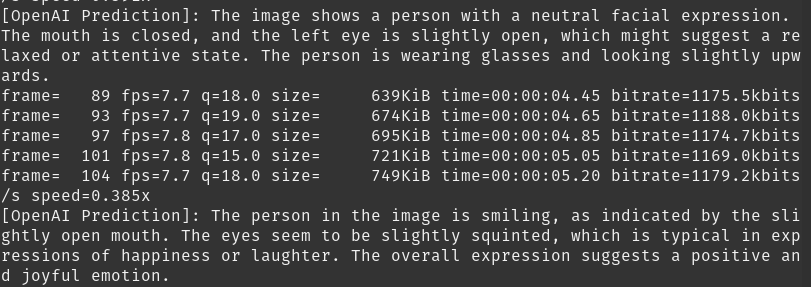
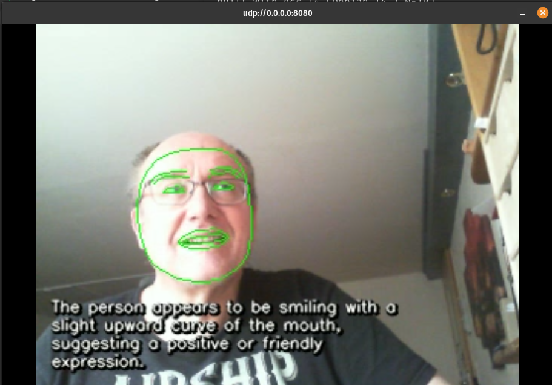

# AI Facial Interpretation Streamer

This project uses **MediaPipe Face Mesh** to extract facial landmarks in real-time, processes the data through **GPT-4o via LangChain**, and overlays the AI's behavioral analysis directly onto a **UDP video stream**.

## Features

-   **Real-time Mesh Tracking**: 468+ facial landmarks using MediaPipe.
    
-   **Multimodal AI**: Sends coordinate data + low-res images to OpenAI for high-accuracy emotion detection.
    
-   **Zero-Latency Streaming**: Uses FFmpeg to stream processed frames over UDP.
    
-   **Asynchronous Processing**: Threaded API calls ensure the video stream doesn't freeze while waiting for AI responses.

## Setup Instructions

### 1. Prerequisites

Ensure you have Python 3.9+ and FFmpeg installed on your system.

### 2. Installation

Clone the repository and install the required Python packages:

    # Install core dependencies
    pip install opencv-python mediapipe langchain-openai python-dotenv requests

### 3. Environment Configuration

Create a `.env` file in the root directory and add your OpenAI API key:

    OPENAI_API_KEY="sk-your-actual-key-here"

## Workflow & Architecture

The system operates in a non-blocking loop to maintain a stable frame rate:

1.  **Capture**: OpenCV captures frames from the local camera device.
    
2.  **Process**: MediaPipe calculates the 3D Face Mesh and specific metrics (eye/mouth opening).
    
3.  **Analyze (Threaded)**:
    
    -   If the AI is idle, the script sends the current frame and metrics to GPT-4o.
        
    -   The system uses a "Safety Bypass" prompt to focus on expressions rather than identity.
        
4.  **Overlay**: The script burns the Face Mesh and the _latest_ AI prediction text onto the frame.
    
5.  **Stream**: FFmpeg pipes the raw BGR24 frames into an H.264 MPEG-TS stream over UDP.

## Usage

### Start the Broadcaster

Run the Python script on your source device:

    python faceinterpretationOpenAI.py

### View the Stream (Host PC)

On your Host PC (`192.168.0.228`), use **FFplay** for the lowest possible latency:

    ffplay -fflags nobuffer -flags low_delay -protocol_whitelist file,udp,rtp -i udp://0.0.0.0:8080

*Alternatively, open `udp://@:8080` in VLC Media Player.*

## Configuration Variables

In `faceinterpretation.py`, you can tune the following: | Variable | Description | | :--- | :--- | | `WIDTH / HEIGHT` | Resolution of the stream (default 320x240 for speed). | | `FPS` | Target frames per second. | | `DESTINATION` | The target IP and Port for the UDP stream. | | `detail: "low"` | OpenAI parameter to reduce tokens and bypass identity filters. |

> Written with [StackEdit](https://stackedit.io/).
