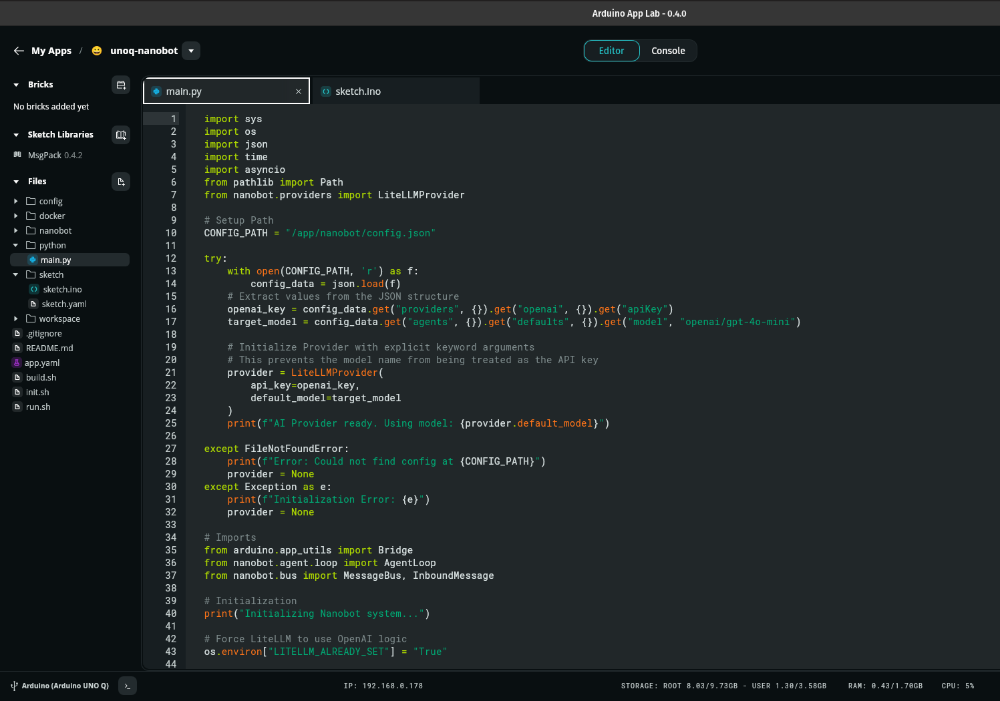

## How to Run

Follow these steps to get your Arduino Uno Q communicating with the Nanobot agent.
### 1. Hardware Preparation

    Connect your Arduino Uno Q to your computer via USB.

    Open sketch/sketch.ino in the Arduino IDE.

    Select the correct Port and Board (Arduino Uno).

    Click Upload. Once the terminal says "Done uploading," the hardware is ready.

### 2. Configuration

Before running the bridge, you must provide your API credentials.

    Navigate to the nanobot directory:
    Bash

    cd /app/nanobot

    Open config.json and insert your OpenAI API key:
    JSON

    "openai": {
      "apiKey": "sk-proj-YOUR_NEW_KEY_HERE",
      "apiBase": null
    }

### 3. Result

The actual query is set in `sketch.ino` with 

    String storedPrompt = "Give a short description of AI agent technolgy";

In the Arduino App Lab the result is shown as output in the console/python, as shown here:

 

