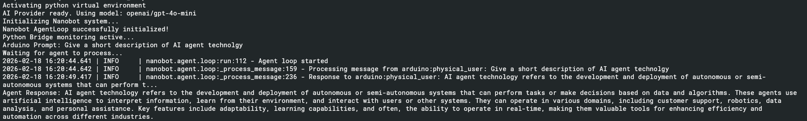

## How to Run

Follow these steps to get your Arduino Uno Q communicating with the Nanobot agent.
### 1. Hardware Preparation

 - Connect your Arduino Uno Q to your computer via USB and open a shell.
 - Download the file [unoq-nanobot-gitversion.zip](./src/unoq-nanobot-gitversion.zip) from the repo
 - Unpack it into the folder ~/ArduinoApps/unoq-nanobot
 - On the Host-PC, open the **Arduino App Lab** and open the project now visible in MyApps.
 - From there, you can after personlisation and configuration start it with the RUN Button. Don't forget to docker build the nanobot as described in the section *Prerequisites*

### 2. Configuration

Before running the bridge, you must provide your API credentials.

    Navigate to the nanobot directory:
    Bash

    cd /app/nanobot

    Open config.json and insert your OpenAI API key:
    JSON

    "openai": {
      "apiKey": "sk-proj-YOUR_NEW_KEY_HERE",
      "apiBase": null
    }

### 3. Result

The actual query is set in `sketch.ino` with 

    String storedPrompt = "Give a short description of AI agent technolgy";

In the Arduino App Lab the result is shown as output in the console/python, as shown here:

 

