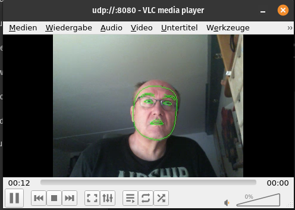

# Integrating and Processing WebCam Videostreams

## Integrating a USB Webcam

 Here

> Bus 001 Device 004: ID 045e:0810 Microsoft Corp. LifeCam HD-3000

is used.
With

    v4l2-ctl --list-devices
we see the video adapters, here video2.

 

On the Arduino, we install the VLC part:

    sudo apt update
    sudo apt install ffmpeg -y
    sudo apt install vlc
    sudo apt install libglib2.0-0 -y

For the first test, we can send the camera stream via UDP to the PC and show the video:

    cvlc -vvv v4l2:///dev/video2 \
    --v4l2-chroma MJPG \
    --v4l2-width 320 \
    --v4l2-height 256 \
    --sout '#std{access=udp,mux=ts,dst=192.168.0.228:8080}'

if necessary, we can enlarge the UDP buffer on the Arduino:

    sudo sysctl -w net.core.wmem_max=4194304 # 4MB Max Write Buffer

Then we configure VLC on the PC:

 - Open in Media: *Open network stream*
 - Enter the network address: **udp://@:8080**
 - Click Show more options
 - and set the storage parameter to **50ms**

  

## Face Landmark Streaming via MediaPipe & FFmpeg

This project demonstrates an efficient pipeline to compute Google MediaPipe Face Landmarks on a **Qualcomm-based Edge Device** (e.g., Arduino Uno R4 / Qualcomm Vision AI) and stream the results with minimal latency to a host PC via UDP.

### How it Works

The program utilizes a multi-stage pipeline designed to provide smooth performance despite limited CPU resources on the Edge device:

1.  **Capture:** OpenCV captures the video stream from the webcam (`/dev/video2`) at an optimized resolution of **320x240 pixels**.

2.  **AI Processing:** Google MediaPipe analyzes the frame. To reduce CPU load, only a specific subset of landmarks is drawn: Face Oval, Eyes, Eyebrows, and Lips.

3.  **Visualization:** By disabling the default heavy landmark markers, the person remains clearly visible behind the overlay, and drawing overhead is minimized.

4.  **Encoding:** The processed frame is passed in **BGR raw format** via a pipe to an FFmpeg subprocess.

5.  **Streaming:** FFmpeg encodes the frames using `libx264` with the `baseline` profile and `zerolatency` tuning. The result is muxed into an MPEG-TS container and sent via **UDP** to the host PC's IP address.


### Prerequisites

-   **Hardware:** Qualcomm / Arduino Edge Board with a camera mapped to `/dev/video2`.

-   **Software:** FFmpeg, Python 3.12, MediaPipe, OpenCV.

-   **Network:** Both devices must be on the same local network.

### Step 1: Installation of the Virtual Environment

[Click the Link](https://github.com/MartinsRepo/Arduino-Uno-Q-Projects/tree/main/10.%20Tips%26Tricks/Pyenv%20Virtualenv//Virtualenv.md)

and activate the environment:

    pyenv activate mpipe


### Step 2: Install mediapipe

    pip install opencv-python mediapipe

### How to Run (Edge Device)
The Phyton Code can be found here:

[mpipe.py](./source/mpipe.py)

and run the program with:

    python mpipe_test.py

### How to Receive (Host PC)

To receive the stream with minimum delay and avoid the "Timestamp conversion" errors often seen in UDP streams, it is recommended to launch **VLC Media Player** via the command line with optimized caching and jitter settings:

    vlc udp://@:8080 --network-caching=100 --clock-jitter=0 --demux=h264
 This results in a landmarks decorated face:



### Key Technical Details

-   **Resolution:** 320x240 (Balancing AI accuracy and encoding speed).

-   **Bitrate:** Forced to 1M to prevent network congestion and UDP packet loss.

-   **GOP (Group of Pictures):** Set to `-g 10` to ensure the stream recovers quickly from network errors.


## Face Interpretation & LLM Integration
This section explains how facial landmark data is processed and interpreted using a local Large Language Model (LLM). To ensure stability on Edge hardware like the **Arduino/Qualcomm board**, the project uses a data-reduction strategy and an asynchronous request-response cycle.

### Prerequisites
Follow the instructions in chapter 1, activate the environment and install additional libs:

    pyenv activate mpipe
    pip install requests
    pip install jsons

### Optimized JSON Data Reduction

Instead of sending all 468 landmarks to the LLM—which would exceed token limits and cause extreme latency—the script extracts only the most significant geometric features.

-   **Key Metrics:** The script calculates specific distances, such as mouth opening (`mouth_open`) and eye aperture (`left_eye_open`), by measuring the Euclidean distance between normalized Y-coordinates.

-   **Token Efficiency:** Coordinates are rounded to 3 decimal places. This provides sufficient precision for spatial reasoning while minimizing the JSON payload size.

-   **JSON Structure:**

    {
    "oval_width": 0.452,
     "mouth_open": 0.081,
      "left_eye": 0.025
    }

### Asynchronous Container Communication (Podman)

The project communicates with an **Ollama** instance running inside a **Podman container**. Since LLM inference is computationally expensive, we use an asynchronous approach to keep the video stream fluid.

-   **Threaded Workers:** Inference requests are handled in a background thread using Python’s `threading` module. This prevents the `requests.post` call from blocking the main video capture loop.

-   **Adaptive Throttle:** A global flag (`is_processing`) ensures that only one request is sent to the LLM at a time. The script waits for the model to finish its response before sending a new set of data. This allows the system to automatically adapt to the hardware's processing speed (e.g., waiting 30+ seconds if necessary).

-   **Container Access:** The script connects to Ollama via the local API endpoint: `http://localhost:11434/api/generate`.

### Setup & Execution

#### Sourcefile
[faceinterpretation.py](./source/faceinterpretation.py)

#### Prepare the Podman Container**

Create your custom model within the Ollama container:
```
podman exec -it ollama ollama create custom-qwen -f /tmp/Modelfile
```
#### Running the Interpreter**

Ensure the `requests` library is installed in your environment:
```
python mpipe_test.py
```
> Written with [StackEdit](https://stackedit.io/).

