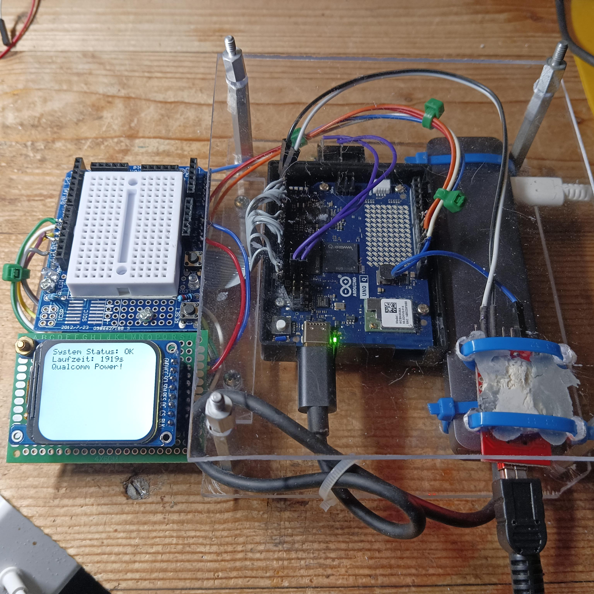
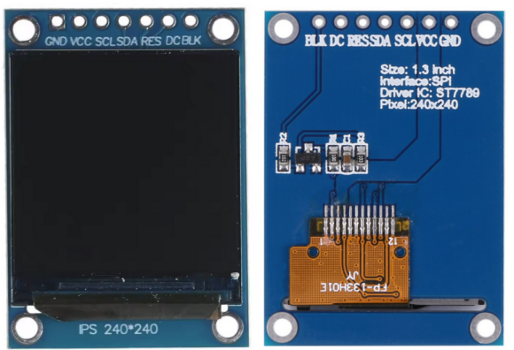
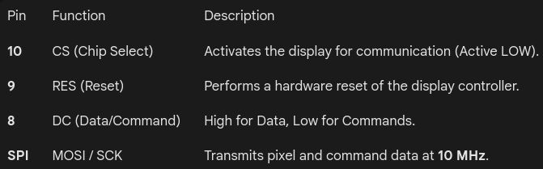

## Documentation: ST7789 Graphics Driver & Python-Bridge for Arduino Uno Q

This documentation describes a custom graphics implementation for the **Arduino Uno Q**, utilizing a dual-architecture approach. The system combines high-level logic in **Python** (running on the Qualcomm processor) with low-level hardware control in **C++**.

### 1. Prototype Board

### 2. Source Code
#### Python Code
[main.py](./source/main.py)

#### Sketch
[sketch.ino](./source/sketch.ino)

### 3. System Architecture

The Arduino Uno Q features a unique "Bridge" architecture. The graphics driver is split into two distinct layers:

-   **The Logic Layer (Python):** Handles application flow, string formatting (f-strings), and timing. It uses the `Bridge.call()` method to send data to the microcontroller side.
    
-   **The Hardware Layer (C++):** An optimized SPI driver that communicates directly with the **ST7789** display controller. It handles the frame buffer, font rendering, and coordinate offsets.

### 4. Hardware Interface (C++)

The C++ driver communicates via the **Serial Peripheral Interface (SPI)**.
#### Display

#### Pin Configuration

#### Key Primitives

-   `setWindow(x0, y0, x1, y1)`: Defines the active drawing area in the ST7789's internal RAM. It applies an **X_OFFSET (20)** and **Y_OFFSET (-25)** to account for the physical alignment of the 240x280 panel.
    
-   `drawPixel(x, y, color)`: The fundamental drawing unit. It sets a 1x1 window and pushes a 16-bit **RGB565** color value.
    
-   `fillScreen(color)`: Rapidly fills the entire display memory with a single color.
### 5. Font Engine & Text Rendering

Since the ST7789 is a raw pixel controller, the driver includes a custom bitmap font engine.

-   **Font Storage:** A 5x7 pixel bitmap font is stored in **PROGMEM** (Flash memory) to save RAM.
    
-   **Scaling:** The `drawCharScaled` function supports a multiplier (`scale`). A scale of 2 transforms a 5x7 character into a 10x14 block on the screen.
    
-   **Word Wrapping:** The `drawTextWrapped` function handles:
    
    1.  **Manual Breaks:** Interprets `\n` as a carriage return.
        
    2.  **Auto Wrapping:** Monitors `cursorX` and automatically moves to the next line if the text exceeds `TFT_WIDTH`.
### 6. The RouterBridge (Cross-Platform Communication)

The core feature of the Uno Q is the ability to trigger C++ functions from Python.

#### The C++ Callback

The function `printFromPython(String text)` is registered as a "provider":

    Bridge.provide("display_print", printFromPython);
When called, it clears the screen and renders the incoming string using the wrapping engine.

#### The Python Loop

The Python side handles the "intelligence" of the application:

    message = f"System Status: OK\nLaufzeit: {counter}s"
    Bridge.call("display_print", message)

This offloads string manipulation and complex logic from the C++ side, allowing for much more flexible application development.

### 7. Technical Specifications summary

-   **Controller:** ST7789 (240x280 LCD).
    
-   **Communication:** SPI (Mode 0, 10 MHz).
    
-   **Color Depth:** 16-bit RGB565 (5 bits Red, 6 bits Green, 5 bits Blue).
    
-   **Rotation:** 90° / 270° Landscape (via `MADCTL` register `0xA0`).
    
-   **Offsets:** Hardware-specific alignment correction via `X_OFFSET` and `Y_OFFSET`.

> Written with [StackEdit](https://stackedit.io/).
