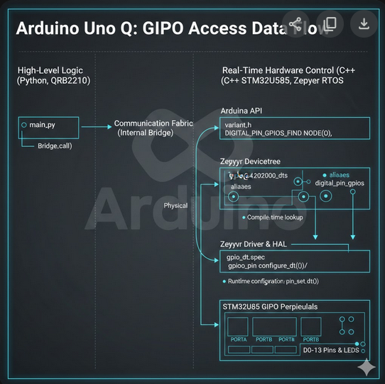
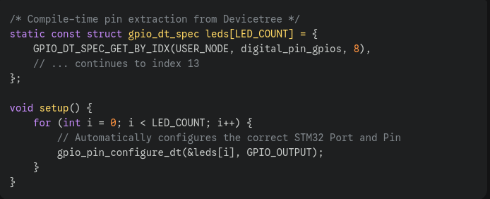
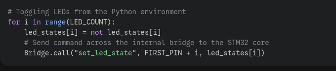

# GPIO Architecture: Arduino Uno Q (STM32U585)

## Key Takeaways

-   **Dynamic Mapping:** Pins are not "hard-wired" in the code; they are resolved at compile-time via the Devicetree.
    
-   **RTOS Powered:** By using Zephyr, the Uno Q handles GPIO tasks with microsecond precision and thread safety.
    
-   **Bridge Architecture:** The board allows seamless interaction between high-level Python logic and low-level C++ hardware control.

Accessing GPIOs on the Arduino Uno Q differs **significantly** from traditional Arduino boards (like the Uno R3). Instead of static pin definitions, it uses a **Hardware Abstraction Layer (HAL)** managed by the **Zephyr Devicetree**.
## Graphical Overview
The following picture was created by **Nano Banana**, so you see some word expressions which are not correct, But the workflow is correct:

 

## The Multi-Layer Mapping Strategy

To access a pin (e.g., D8), the system moves through three distinct layers:

 

## Deep Dive: The Devicetree (.dts)

The "Source of Truth" for the hardware is the Devicetree. Unlike classic Arduino where pins are hardcoded in the compiler, the Uno Q defines pins as nodes. When you call `GPIO_DT_SPEC_GET_BY_IDX`, you are asking Zephyr to look into the compiled Devicetree binary to find which physical STM32 port/pin is linked to that Arduino index.

## Dual-Core Interaction (Python & C++)

One of the unique features of the Uno Q is the ability to control GPIOs via a **Bridge**.

-   **Python (High-Level):** Runs on the application processor (QRB2210). It sends commands like `Bridge.call("set_led_state", pin, state)`.
    
-   **C++/Zephyr (Real-Time):** Runs on the STM32U585. It receives the bridge call and executes the hardware toggle using `gpio_pin_set_dt()`.

## Code Example: Advanced GPIO Toggle (D8–D13)

### The Zephyr Logic (Real-Time Side)

In the `.ino` file, we use `gpio_dt_spec`. This structure is superior to simple integers because it contains the **GPIO port controller**, the **pin number**, and the **active-high/low flags** all in one object.

 

and here you find the sketch:
[sketch.ino](./src/sketch.ino)

### The Python Logic (Application Side)

The Python script provides the "intelligence" or UI, communicating with the hardware layer through the Bridge API.

 
 
and here you find the python skript: 
[main.py](./src/main.py)

Schematic of the LED Array:
 

> Written with [StackEdit](https://stackedit.io/).
