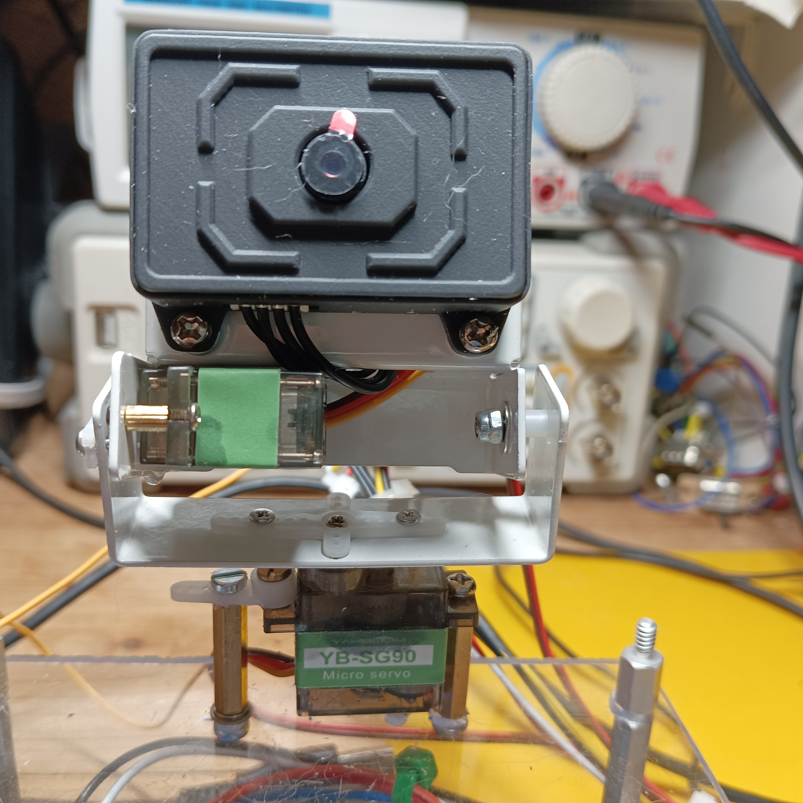

## Demonstrating Servo Usage

This simple demo shows the ranging of two servo motors for left / right and up / down movement, tilt and pan functions have been implemented.

 - Power supply: 5V external, eg from the USB Hub used here
 - Pan - Pin D5
 - Tilt - Pin D6 both PWM outputs

Find the source code here:
[servodemo.zip](./src/servodemo.zip)

Copy and expand this code in the Arduino shell to

    cd ~/ArduinoApps
    unzip servodemo.zip

and open it on the Host in the Arduino App Lab.

Add the libraries:

> MsgPack 0.4.2
> MessagePack implementation for Arduino (compatible with other C++ apps)

and

> Servo 1.3.0
> by Michael Margolis, Arduino
> Allows Arduino boards to control a variety of servo motors.

