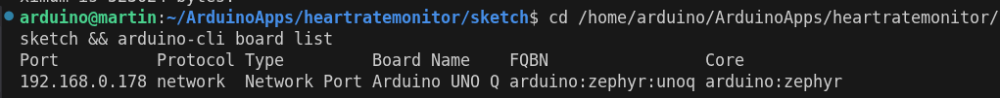
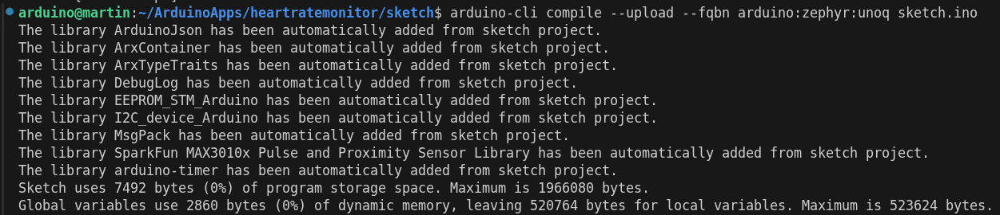

# Compiling, Flashing and Debugging

## Test the manual Commands

### Compile the ino sketch:

 - Goto your sketch folder
 - and execute the arduino-cli command

    cd /home/arduino/ArduinoApps/heartratemonitor/sketch 
    arduino-cli compile --fqbn arduino:zephyr:unoq sketch.ino

### Upload the sketch

you can check the used board:

    arduino-cli board list

    arduino-cli compile --upload --fqbn arduino:zephyr:unoq sketch.ino

## Configuring a VSCode Task

Doing compiling and uploading, we can configure a task. / lauch.json:

[tasks.json](./tasks.json)

[launch.json](./launch.json)

> Written with [StackEdit](https://stackedit.io/).
