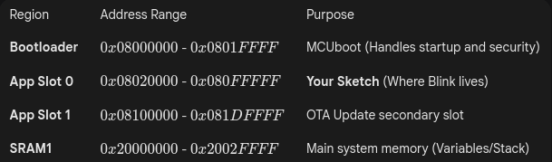
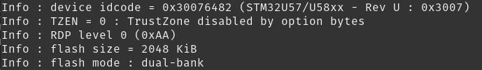
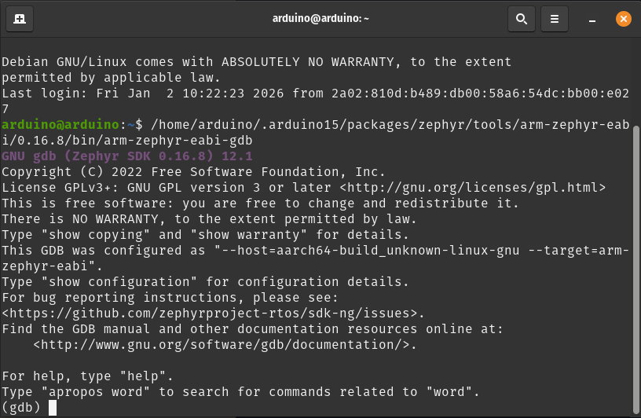
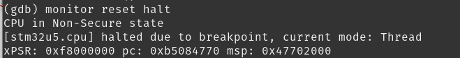
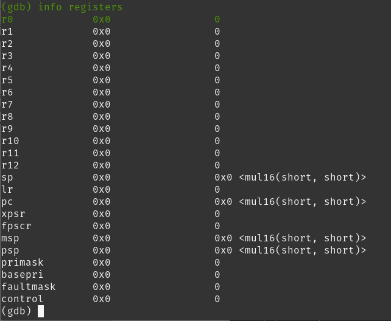
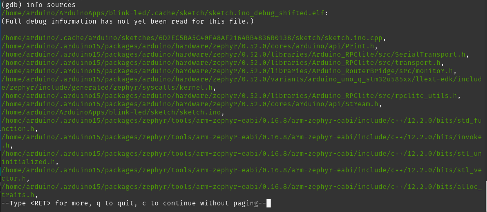
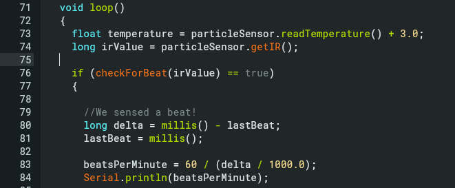
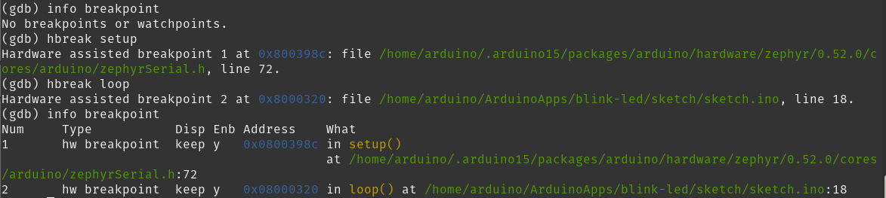

# Debugging with OpenOCD 

On the Linux machine, the **OpenOCD-Debugger** is preinstalled and connects via **SWD (Serial Wire Debug)** with the Arduino processor **STM32U5**) 

## Basic Rules
On the Arduino Uno Q (STM32U585 + Zephyr):

 - Flash always contains Zephyr firmware.
 - Your sketch is not a standalone program.
 - Your sketch is a relocated object that Zephyr executes at runtime.

## Address Map

 

## Restore the Factory Firmware

** The Problem: Memory Offset **

On the Arduino Uno Q, the first 128KB (0x20000) of flash is typically reserved for the **MCUboot bootloader**.

- If you flash your application binary at offset `0`, you overwrite the bootloader.
    
-   The CPU starts at `0x08000000`, finds your application data instead of bootloader instructions, and immediately crashes.

In this case, we must restore the bootloader: 

    /opt/openocd/bin/openocd -s /opt/openocd -f openocd_gpiod.cfg -c "init; reset halt" -c "program /home/arduino/.arduino15/packages/arduino/hardware/zephyr/0.52.0/firmwares/zephyr-arduino_uno_q_stm32u585xx.bin 0x08000000 verify reset exit"

You can fetch also information:

    /opt/openocd/bin/openocd -s /opt/openocd -f openocd_gpiod.cfg -c "init; flash probe 0; exit"

with

 

Verify the fix:

    monitor mdw 0x08020000 4

It should give:

> 0x08020000: 00000000 00000001 00000002 00000050 

## PreWork to be Done

### Generating the **ELF** Outpout

Using the ** arduino-cli** command, we produce:

    arduino-cli compile --fqbn arduino:zephyr:unoq --output-dir /home/arduino/ArduinoApps/blink-led/.cache/sketch /home/arduino/ArduinoApps/blink-led/sketch/sketch.ino

 
 
Now we can have a look to the address table

    /home/arduino/.arduino15/packages/zephyr/tools/arm-zephyr-eabi/0.16.8/bin/arm-zephyr-eabi-objdump -h /home/arduino/ArduinoApps/blink-led/.cache/sketch/sketch.ino_debug.elf
    
 

As we see, we start at address 00000000h, but we should start at 08000000h. So we shift with objdump

    /home/arduino/.arduino15/packages/zephyr/tools/arm-zephyr-eabi/0.16.8/bin/arm-zephyr-eabi-objcopy --change-addresses 0x08000000 /home/arduino/ArduinoApps/blink-led/.cache/sketch/sketch.ino_debug.elf /home/arduino/ArduinoApps/blink-led/.cache/sketch/sketch.ino_debug_shifted.elf

in our new file with the objdump command above *sketch.ino_debug_shifted.elf*

 

A short check gives: 

    /home/arduino/.arduino15/packages/zephyr/tools/arm-zephyr-eabi/0.16.8/bin/arm-zephyr-eabi-readelf -h /home/arduino/ArduinoApps/blink-led/.cache/sketch/sketch.ino_debug_shifted.elf

 

** Important: ** We have a REL file type! 
This means: only symbole + sections, but no program header. Therefore: 
*Size of program headers: 0    and: 
Number of program headers: 0*. 
So, this file is only a symbol container.

We can upload the compiled version:

    arduino-cli upload --fqbn arduino:zephyr:unoq -v /home/arduino/ArduinoApps/blink-led/sketch/

 

## Steps

### Arduino Bash
Using the Arduino-Lab or a ssh access.

### Start the GDB Server
In the bash: 

    arduino-debug -c "init" -c "reset halt"
    
The **GDB Server** runs on **Port 3333**.

The result is:

 

Keep this Window open and open another Arduino terminal.

### Starting the Debugger

Open a new SSH bash and start the debugger with the firmware:

    /home/arduino/.arduino15/packages/zephyr/tools/arm-zephyr-eabi/0.16.8/bin/arm-zephyr-eabi-gdb /home/arduino/.arduino15/packages/arduino/hardware/zephyr/0.52.0/firmwares/zephyr-arduino_uno_q_stm32u585xx.elf

We will get the debugger console:

 

### Set the Architecture

    set architecture armv8-m.main
    set arm force-mode thumb

### Connect to DGB Server

Connect to the GDB Server

    target extended-remote :3333

As a result, you see:

> (gdb)  target extended-remote :3333
Remote debugging using :3333
0xeffffffe in ?? ()

Annotation: This is not an error. It means: **This is a normal state after  Reset/Halt.**  
`0xEFFFFFFE` is a _Exception Return / invalid PC placeholder_, no Code.

With 

    monitor reset halt

we see the correct behavior.

 

### Reading the Registers
First update the cache:

    maintenance flush register-cache

and than read the registers:

    info registers pc
  
Show

> info registers pc
> 
>pc             0x800a9d8           0x800a9d8  <z_arm_reset>

    info registers

The result is: 

 

### Verifying the Setup

    info files
You get something like this:
 

    info function loop

You get:

 
 
This works also with library functions.

    info sources
We get the dependencies of all files included:

 

### Debugging

### Breakpoint Handling

#### Check for breakpoints

    info breakpoint

If nothing is set, we see:

 

#### Break at a function

By default, GDB prefers **software breakpoints** (patching code).  
On MCUs this sometimes fails.

##### Force hardware breakpoints (STM32U5 supports 8):

    hbreak setup
    hbreak loop

Loop part of the sketch:

 

 
 

Now we have set our breakpoints and restart the MCU

    monitor reset halt

 

#### Removing a Breakpoint

    info breakpoints

> Breakpoint 1 at 0x45a: file /home/arduino/ArduinoApps/heartratemonitor/sketch/sketch.ino, line 82.
(gdb) info breakpoints
Num     Type           Disp Enb Address    What
1       breakpoint     keep y   0x0000045a in loop() 
                                           at /home/arduino/ArduinoApps/heartratemonitor/sketch/sketch.ino:82

> 
> 
> Written with [StackEdit](https://stackedit.io/).

> Written with [StackEdit](https://stackedit.io/).
