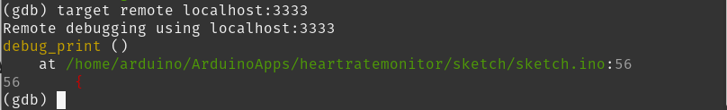

# Debugging with OpenOCD 

On the Linux machine, the **OpenOCD-Debugger** is preinstalled and connects via **SWD (Serial Wire Debug)** with the Arduino processor **STM32U5**) 
For proper usage, we must install first:

    sudo apt update
    sudo apt install gdb-multiarch

The **GDB Server** runs on **Port 3333**.

## Steps

### Arduino Bash
Using the Arduino-Lab or a ssh access.

### Start the GDB Server
In the bash: 

    arduino-debug
The result is:
 

Keep this Window open and open another Arduino terminal.

### Start the Debugger

Normally the sketches are located on the Arduino in:
~/ArduinoApps/name of your sketch/.cache/sketch
so you evoke the debugger with
   
    gdb-multiarch ~/ArduinoApps/<name of your sketch>/.cache/sketch/sketch.ino_debug.elf
In _debug.elf, you have the symbols. We get something like this:

 

As an result, you are seeing the debugger shell as (gdb).

### In the (gdb) Debugger Shell:

Connect to the GDB Server

    (gdb) target remote localhost:3333

As a result, you see:

 

### Make GDB understand your program

Once connected:

    (gdb) file ~/ArduinoApps/heartratemonitor/.cache/sketch/sketch.ino_debug.elf

This ensures:
-   symbols are loaded

-   source lines are mapped
    
-   variables are visible

### Verifying the Setup

    (gdb) info files
You get something like:

> Symbols from "/home/arduino/ArduinoApps/heartratemonitor/.cache/sketch/sketch.ino_debug.elf".
Remote target using gdb-specific protocol:
	`/home/arduino/ArduinoApps/heartratemonitor/.cache/sketch/sketch.ino_debug.elf', file type elf32-littlearm.
	Entry point: 0x16a4
	0x00000000 - 0x00001b7c is .text
	0x00001b7c - 0x00001d5c is .rodata
	0x00001d5c - 0x00001d74 is .data
	0x00001d74 - 0x00002888 is .bss
	0x00002888 - 0x00002890 is .exported_sym
	0x00002890 - 0x000028a0 is .init_array
	While running this, GDB does not access memory from...
Local exec file:
	`/home/arduino/ArduinoApps/heartratemonitor/.cache/sketch/sketch.ino_debug.elf', file type elf32-littlearm.
	Entry point: 0x16a4
	0x00000000 - 0x00001b7c is .text
	0x00001b7c - 0x00001d5c is .rodata
	0x00001d5c - 0x00001d74 is .data
	0x00001d74 - 0x00002888 is .bss
	0x00002888 - 0x00002890 is .exported_sym
	0x00002890 - 0x000028a0 is .init_array

    (gdb) info functions loop
You get:

> ll functions matching regular expression "loop":

File /home/arduino/ArduinoApps/heartratemonitor/sketch/sketch.ino:
71:	void loop();
(gdb) info sources
/home/arduino/ArduinoApps/heartratemonitor/.cache/sketch/sketch.ino_debug.elf:
(Full debug information has not yet been read for this file.)

/home/arduino/ArduinoApps/heartratemonitor/.cache/sketch/sketch/sketch.ino.cpp, /home/arduino/ArduinoApps/heartratemonitor/sketch/sketch.ino, 
... and so on

    (gdb) info sources

> /home/arduino/ArduinoApps/heartratemonitor/.cache/sketch/sketch.ino_debug.elf:
(Full debug information has not yet been read for this file.)
/home/arduino/ArduinoApps/heartratemonitor/.cache/sketch/sketch/sketch.ino.cpp, /home/arduino/ArduinoApps/heartratemonitor/sketch/sketch.ino, 
/home/arduino/.arduino15/packages/arduino/hardware/zephyr/0.52.0/cores/arduino/zephyrSerial.h, 
... and so on

### Debugging

    (gdb) info registers
We get:

> r0             0x1                 1
r1             0x20034a5c          537086556
r2             0x3580              13696
r3             0x2341              9025
r4             0x20035490          537089168
r5             0x802b6d8           134395608
r6             0x8e98              36504
r7             0x0                 0
r8             0x8021388           134353800
r9             0xa350              41808
r10            0xffffffff          -1
r11            0xffffffff          -1
r12            0x0                 0
sp             0x20034a70          0x20034a70
lr             0x8016e79           134311545
pc             0x8006374           0x8006374
xpsr           0x9000000           150994944
fpscr          0x0                 0
... and so on

### Breakpoint Handling

#### Break at a source line

    (gdb) break sketch.ino:82  (example)
   

break <line number>

#### Removing a Breakpoint

    (gdb) info breakpoints

> Breakpoint 1 at 0x45a: file /home/arduino/ArduinoApps/heartratemonitor/sketch/sketch.ino, line 82.
(gdb) info breakpoints
Num     Type           Disp Enb Address    What
1       breakpoint     keep y   0x0000045a in loop() 
                                           at /home/arduino/ArduinoApps/heartratemonitor/sketch/sketch.ino:82

> 
> 
> Written with [StackEdit](https://stackedit.io/).

-   source lines are mapped
    
-   variables are visible

### Verifying the Setup

    (gdb) info files
You get something like:

> Symbols from "/home/arduino/ArduinoApps/heartratemonitor/.cache/sketch/sketch.ino_debug.elf".
Remote target using gdb-specific protocol:
	`/home/arduino/ArduinoApps/heartratemonitor/.cache/sketch/sketch.ino_debug.elf', file type elf32-littlearm.
	Entry point: 0x16a4
	0x00000000 - 0x00001b7c is .text
	0x00001b7c - 0x00001d5c is .rodata
	0x00001d5c - 0x00001d74 is .data
	0x00001d74 - 0x00002888 is .bss
	0x00002888 - 0x00002890 is .exported_sym
	0x00002890 - 0x000028a0 is .init_array
	While running this, GDB does not access memory from...
Local exec file:
	`/home/arduino/ArduinoApps/heartratemonitor/.cache/sketch/sketch.ino_debug.elf', file type elf32-littlearm.
	Entry point: 0x16a4
	0x00000000 - 0x00001b7c is .text
	0x00001b7c - 0x00001d5c is .rodata
	0x00001d5c - 0x00001d74 is .data
	0x00001d74 - 0x00002888 is .bss
	0x00002888 - 0x00002890 is .exported_sym
	0x00002890 - 0x000028a0 is .init_array

    (gdb) info functions loop
You get:

> ll functions matching regular expression "loop":

File /home/arduino/ArduinoApps/heartratemonitor/sketch/sketch.ino:
71:	void loop();
(gdb) info sources
/home/arduino/ArduinoApps/heartratemonitor/.cache/sketch/sketch.ino_debug.elf:
(Full debug information has not yet been read for this file.)

/home/arduino/ArduinoApps/heartratemonitor/.cache/sketch/sketch/sketch.ino.cpp, /home/arduino/ArduinoApps/heartratemonitor/sketch/sketch.ino, 
... and so on

    (gdb) info sources

> /home/arduino/ArduinoApps/heartratemonitor/.cache/sketch/sketch.ino_debug.elf:
(Full debug information has not yet been read for this file.)
/home/arduino/ArduinoApps/heartratemonitor/.cache/sketch/sketch/sketch.ino.cpp, /home/arduino/ArduinoApps/heartratemonitor/sketch/sketch.ino, 
/home/arduino/.arduino15/packages/arduino/hardware/zephyr/0.52.0/cores/arduino/zephyrSerial.h, 
... and so on

### Debugging

    (gdb) info registers
We get:

> r0             0x1                 1
r1             0x20034a5c          537086556
r2             0x3580              13696
r3             0x2341              9025
r4             0x20035490          537089168
r5             0x802b6d8           134395608
r6             0x8e98              36504
r7             0x0                 0
r8             0x8021388           134353800
r9             0xa350              41808
r10            0xffffffff          -1
r11            0xffffffff          -1
r12            0x0                 0
sp             0x20034a70          0x20034a70
lr             0x8016e79           134311545
pc             0x8006374           0x8006374
xpsr           0x9000000           150994944
fpscr          0x0                 0
... and so on

### Breakpoint Handling

#### Break at a source line

    (gdb) break sketch.ino:82  (example)
   

break <line number>

#### Removing a Breakpoint

    (gdb) info breakpoints

> Written with [StackEdit](https://stackedit.io/).
