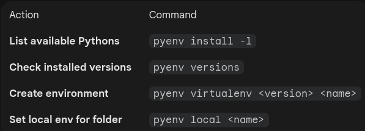

## How to handle different Python Version

Using **pyenv virtualenv** or **conda** is not the solution, short implementing an APP in the Arduino App Lab, we don't have the possibilty to do so. In our case, **Google Mediapipe** doesn't support Python v3.13 (in Jan 26) as we have in our Debian image.

For reasons as discussed in the chapter [Running Ollama Models](https://github.com/MartinsRepo/Arduino-Uno-Q-Projects/blob/main/01.%20GenAI%20Support/01.%20Running%20Ollama%20Models/Ollama.md) we are using **Podman** shifted to an external storage sdcard.

To bypass local dependency conflicts and the lack of MediaPipe support for Python 3.13, this project containerizes the **Face AI Service** of the [**OpenAI Faceinterpretor**](https://github.com/MartinsRepo/Arduino-Uno-Q-Projects/tree/main/05.%20Application%20Development/OpenAI%20FaceInterpretor) using **Podman**. This ensures a stable **Python 3.12** environment with direct hardware access to the camera, providing a seamless AI-processing API for the Arduino Lab MicroPython script.

## Installing pyenv virtualenv

### 1. Install Required Dependencies

To build different Python versions from source, you need to install several system libraries first. Open your terminal (via SSH, ADB, or the local desktop) and run:

    sudo apt update
    sudo apt install -y make build-essential libssl-dev zlib1g-dev \libbz2-dev libreadline-dev libsqlite3-dev wget curl llvm \libncursesw5-dev xz-utils tk-dev libxml2-dev libxmlsec1-dev \libffi-dev liblzma-dev git

### 2. Install pyenv

The most reliable way to install `pyenv` is using the automatic installer.

    curl https://pyenv.run | bash

After the script finishes, you **must** add the following lines to your `~/.bashrc` file to ensure `pyenv` loads every time you open a terminal:

    echo 'export PYENV_ROOT="$HOME/.pyenv"' >> ~/.bashrc echo '[[ -d $PYENV_ROOT/bin ]] && export PATH="$PYENV_ROOT/bin:$PATH"' >> ~/.bashrc
    echo 'eval "$(pyenv init - bash)"' >> ~/.bashrc
    echo 'eval "$(pyenv virtualenv-init -)"' >> ~/.bashrc

Apply the changes:

    source ~/.bashrc

### 3. Verify and Create a Virtual Environment

Now that `pyenv` is ready, you can install a specific Python version (e.g., 3.11.0) and create a virtual environment for your Arduino project.

> [!NOTE] Installing a Python version on the Uno Q can take 10–20 minutes because the quad-core ARM processor is compiling it from source.

1.  **Install Python:** `pyenv install 3.12.0`

2.  **Create Virtualenv:** `pyenv virtualenv 3.12.0 mpipe`

3.  **Activate it:** `pyenv activate mpipe`

### 4.Summary Table: Common Commands

> Written with [StackEdit](https://stackedit.io/).
