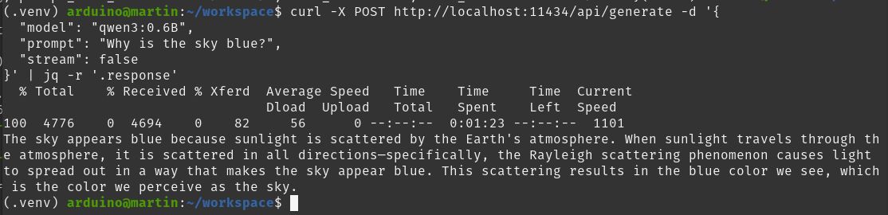

# Connecting the Podman Container and additional Hardware

## License 
Licensed under [Apache Version 2.0](https://www.apache.org/licenses/LICENSE-2.0). This repo follows the licence terms.

## First Steps

We can ramp up our container with port mapping by:

    podman run -d \
      --name ollama \
      -p 11434:11434 \
      -v /mnt/sd/ollama_models:/root/.ollama \
      ollama ollama run qwen3:0.6b
Now the ollama model should run, booting up takes several seconds.

With posting some commands, you should get back some results. To get back some meaningful results, we should filter it. Therefor install:

    sudo apt update && sudo apt install jq
and posting

    curl -X POST http://localhost:11434/api/generate -d '{
      "model": "qwen3:0.6B",
      "prompt": "Why is the sky blue?",
      "stream": false
    }' | jq -r '.response'

*(Annotation: The stream parameter is set to false, meaning the result is displayed, if qwen3 has finished.)*

The result can be seen here:

As seen, the answer takes nearly about 1.5 min. So the usage of a LLM on the Arduino is not a real time application, but some non time-critical reasoning of a signal processing program flow.

## Access via Python Script
[Code Snippet ollama_client.py](./src/ollama_client.py)

### Create a Python Environment

    sudo apt install python3.13-venv
then: 

    source .venv/bin/activate
and 

    pip install requests
Then you can run the code:

    python3 src/ollama_client.py
The result should be:

 

> Written with [StackEdit](https://stackedit.io/).
