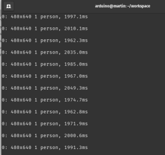

# Processing the Videostreams

## License 
Licensed under [Apache Version 2.0](https://www.apache.org/licenses/LICENSE-2.0). This repo follows the licence terms.

## Background
The idea behind is to capture the face landmarks via YOLO8 [# ultralytics](https://pypi.org/project/ultralytics/) and provide the landmarks to qwen3 for interpretation. While YOLOv8 is primarily known for object recognition, Ultralytics has also released specialized models that can be used for tasks such as pose estimation and segmentation. For your specific requirement—extracting viewpoints—the YOLOv8 Pose Estimation model is ideal because it provides keypoints.

## First Steps
We are using the .venv already created in chapter 2.

    pip install ultralytics
    pip install opencv-python

The sample code for face detection is:
[Code Snippet streaming.py](./src/streaming.py)

Then open a second SSH Shell on the Arduino. We must start our V4L2-streaming.
First set (only one time)

      mkfifo /tmp/vlc_pipe

and then start: 
    
    cvlc -vvv /tmp/vlc_pipe \
	    --demux rawvideo \
	    --rawvid-fps 10 \
	    --rawvid-width 320 \
	    --rawvid-height 256 \
	    --rawvid-chroma BGR3 \
	    --sout #transcode{vcodec=MJPG,vb=500}:std{access=udp,mux=ts,dst=192.168.0.228:8080}'

The output is:

> Written with [StackEdit](https://stackedit.io/).
